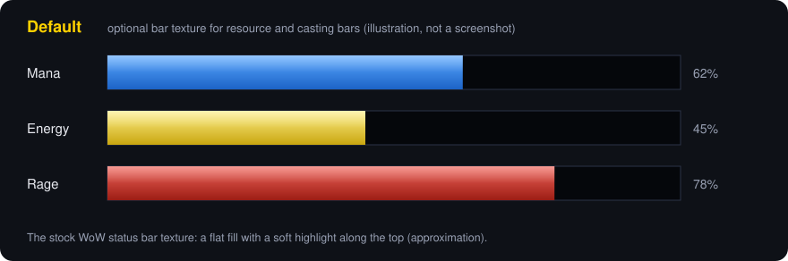
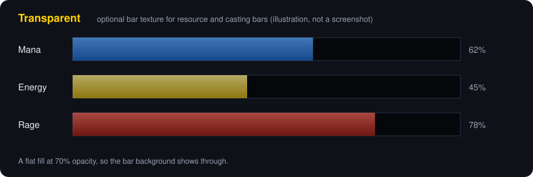
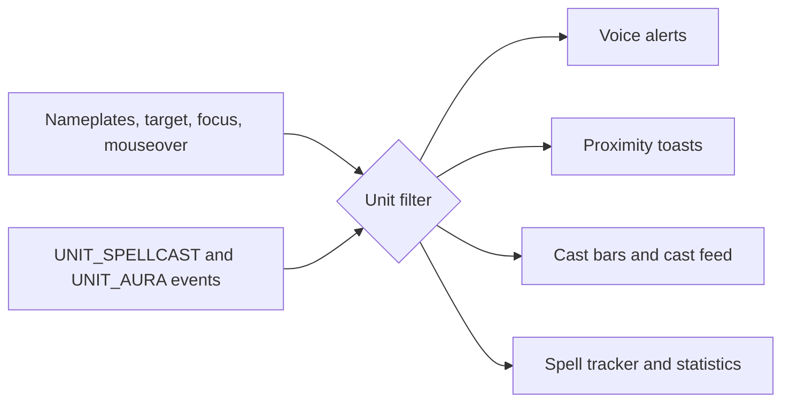

<b>Voiced PvP combat suite for WoW Forever.</b> 
It builds on the legacy of SoundAlerter and adds proximity voice-toast alerts, casting bars, resource and spell cooldown management and combo point tracking. 
<i>It is still an early beta, please expect bugs.</i>

> [!IMPORTANT]
> **What changed:** WoW Forever permanently restricts `COMBAT_LOG_EVENT_UNFILTERED` for every third-party addon. That is a Blizzard platform decision, not a bug, and not addon-specific. SoundAlerter has been rebuilt around nameplate and unit-event tracking instead.

| Gone | Kept |
| :--- | :--- |
| True zone-wide ambient detection of enemies you haven't targeted, moused over, or whose nameplate isn't visible | Voice alerts for your target, focus, and any enemy player with a visible nameplate nearby |
| The Custom Sound Alert engine's "any enemy anywhere" matching (now scoped to nameplate-visible/target/focus enemies) | Proximity detection and toasts (now nameplate + target/mouseover driven) |
| Ally-side CC/cast monitoring (friendly-target alert categories) | Battleground flag tracking (already chat-message based, unaffected) |
| | Casting bars, cast feed, resource bars, spell tracker (never depended on combat log) |
| | All existing settings and Custom Sound Alert rules carry over automatically, no reconfiguration needed |

---

## Overview

A voice and visual alert addon for arena and battleground PvP: instant callouts for enemy cooldowns, CC, and interrupts, plus a full combat awareness suite (proximity detection, flag tracking, resource bars, cast bars, and spell tracking).

| Feature | What it does | Jump |
| :--- | :--- | :--- |
| **Quick Start** | Pick a style, check the sound, choose which alert types you hear | [Quick Start](#quick-start---arena-ready-in-a-minute) |
| **Voice Alerts** | 450+ spell callouts for target, focus and nameplate enemies | [Voice Alerts](#voice-alerts---instant-audio-callouts) |
| **Proximity Alerts** | Sticky toasts with distance, buffs and click to target | [Proximity](#proximity-alerts---range-detection) |
| **Battleground Alerts** | Team-aware flag tracking for WSG and Eye of the Storm | [Battlegrounds](#battleground-alerts---objective-tracking) |
| **Resource Bars** | Health, power and combo points, optional bar textures (Waves, Streaks, Motes, Fog) | [Resource Bars](#resource-bars---power-tracking) |
| **Casting Bars** | Player, target and focus cast bars | [Casting Bars](#casting-bars---accurate-timing) |
| **Cast Feed** | Scrolling history of casts per unit | [Cast Feed](#cast-feed---scrolling-cast-history) |
| **Spell Tracker** | Icons for buffs, debuffs and cooldowns that work in combat | [Spell Tracker](#spell-tracker---aura-management) |
| **Spell Finder** | Search the spell database for IDs and descriptions | [Spell Finder](#spell-finder---database-access) |
| **Statistics** | What triggered your alerts, who and where | [Statistics](#statistics---combat-intelligence) |

**Performance**: Event handlers filter on unit token identity before touching any API, keeping per-event cost negligible even in large fights. Flag-alert timing is verifiable in-game via `/sa flag metrics`.

---

## Getting Started

### Installation
1. Download the latest release.
2. Extract the `SoundAlerter` folder to `World of Warcraft/Interface/AddOns/`.
3. Launch WoW and check the minimap button (alternatively use shift and ctrl clicks to shortcut proximity and battleground alerts).

### Quick Setup
1. Type `/sa`.
2. Go to the **Quick Start** tab; the top line always shows your current setup.
3. Pick your style (Arena player, Battleground player or Everything), or set the zones and the alert scope yourself.
4. Set the volume and press **Play test sound**.
5. Choose which alert types you want to hear: enemy defensives and buffs, spell casts, cooldowns, crowd control on you and on enemies, interrupts, chat messages.
6. Use **Tabs at a glance** to jump to the tab you need next.

---

## The Complete Suite

### Quick Start - Arena Ready in a Minute
The first tab of `/sa`, built for new players.

* A summary line with your current setup: zones, scope, volume, how many alert types are on
* Three style presets: Arena player, Battleground player, Everything (zones and scope only, never the alert types)
* Zones (Arena, Battleground, World PvP) and one choice for who triggers alerts: target and focus only, or all enemies in range
* Master volume with a **Play test sound** button
* Seven alert-type switches: enemy defensives and buffs, spell casts, cooldowns, crowd control on you, crowd control on enemies, interrupts, chat messages
* **Tabs at a glance**: every tab with one line on what it is for, and a button that opens it

**Configuration**: `/sa` -> Quick Start tab

---

### Voice Alerts - Instant Audio Callouts
450+ critical spell callouts with professional voice alerts, for your target, focus, and any enemy player with a visible nameplate nearby.

* Defensive cooldown, CC, and interrupt alerts
* Self and enemy debuff alerts
* English voice pack

**Configuration**: `/sa` -> Voice Alerts tab

---

### Proximity Alerts - Range Detection
Visual and audio alerts for nearby enemies. Sticky toasts include instant targeting and countdown timers.

* Automatic enemy detection via nameplate range, target, or mouseover
* Distance shown on the toast: Close, Nearby, or Detected
* Group size context: "Solo" or "N nearby" based on currently-visible enemies
* Up to 3 active buff/debuff icons shown on the toast, with remaining duration (defensive CDs, mount, existing debuffs)
* One-click targeting from toast
* PvE mode filtering
* Stacked toasts slide smoothly into place as older ones expire, instead of snapping

**Configuration**: `/sa` -> Proximity Alerts tab
**Commands**: `/sa toast test` (preview), `/sa toast status` (metrics)

---

### Battleground Alerts - Objective Tracking
Team-aware CTF tracking for WSG and Eye of the Storm.

* Class identification via GUID decoding, with a live unit-scan fallback
* Visual flag status indicators

**Configuration**: `/sa` -> Battleground Alerts tab
**Commands**: `/sa flag myteam` (team check), `/sa flag metrics` (stats)

---

### Resource Bars - Power Tracking
Unified bars for Health, Mana, Energy, Rage, and Combo Points.

* Feral Druid form-switching support
* Position memory per profile
* Pixel-perfect: sizes, positions and the fill edge snap to whole screen pixels (exact at scale 1.0; other scale values stay approximately sharp)
* Event-driven: a bar only runs a per-frame update while its low-power pulse or overcap glow is showing
* Selectable **Bar Texture**, shared with the casting bars: Default, Solid, Transparent, plus four moving textures (off by default, horizontal bars only)
  * **Waves**: the top edge of the fill is a smooth, random, slowly travelling water surface in three depth layers (redraws at 20 Hz)
  * **Streaks**, **Motes** and **Fog**: three tiled layers scroll across the fill at different speeds for a sense of depth (30 Hz)
* The moving textures only run an update while a bar using one is visible

**Configuration**: `/sa` -> Resource Management tab

---

### Casting Bars - Accurate Timing
Cast bars for Player, Target, and Focus units.

* Channeled and mid-cast targeting support
* Finish animations: a completed cast flashes green and fades out, an interrupted cast turns red, shows "Interrupted" and fades out; cancelled casts just disappear
* Configurable orientation (horizontal/vertical) and fill direction per bar
* Same bar texture choices as the resource bars, including Waves, Streaks, Motes and Fog (see Resource Bars); vertical casting bars keep the default texture
* Pixel-perfect: sizes, positions and the fill edge snap to whole screen pixels at any UI scale, and the bars cost nothing while idle (the update loop only runs during a cast; the time text only redraws when its digits change)

**Configuration**: `/sa` -> Casting Bars tab

---

### Cast Feed - Scrolling Cast History
Casts by you, your target, focus and party members (Party 1-4) appear as icons that move along a row. Each unit has its own row. Your own casts are fully readable, including instants.

* One row per unit: Player, Target, Focus, Party 1-4, each shown or hidden separately
* Direction, scale and position are set per row (left, right, up or down): pick a row under *Edit Row*, or copy its settings to all rows in one click; icon size, spacing, length and speed are shared
* Hover any icon to freeze its row and see the spell and its caster, with the spell ID in gold on the bottom line; moving off it speeds the row up until it is current again
* Border colour shows state: casting/channeling, success, interrupted, cancelled
* Optional time between casts (`MM:SS:ms`, cast start to cast start) shown between neighbouring icons; icons spread out to make room, and the text size is adjustable
* Row length, speed and catch-up speed are adjustable; rows are draggable when unlocked
* Settings live in the active profile, so profile switch, copy and reset apply to it
* Off by default

<b>Limitations</b> (what the client hides from addons)

The client hides other units' casts from addons. A hidden spell still gets its icon (from the cast bar) and its cast name on hover, but not the full spell tooltip, and the addon can never read, match or filter it; per-spell alerts on other units stay impossible. Instant casts by other units, players and NPCs alike, are not delivered at all and cannot be shown. Their aura changes cannot stand in for them either: the client hides the contents of other units' aura updates and blocks reading their aura list. An instant whose event does arrive but whose spell cannot be displayed shows a generic lightning marker.

**Configuration**: `/sa` -> Cast Feed tab

---

### Spell Tracker - Aura Management
Icon-based tracking for buffs, debuffs, and cooldowns.

* Simultaneous player and target tracking
* Aura spiral animation and duration number, kept working in combat (when the game hides the aura, a timer starts on your own cast using the duration last seen out of combat, or a per-spell Aura Duration you set for combat-only spells)
* Optional spell cooldown numbers (gold, top of icon) for spells with Track Cooldown enabled, also working in combat
* Optional green "Ready!" in the same spot when a tracked spell is off cooldown (`Show 'Ready!' When Cooldown Finished`, off by default)
* State borders: grey when idle, green for a buff, red for a debuff, with a glow that flashes white when an aura is applied, pulses red in the last 3 seconds, pulses green when the spell is ready and stays faintly blue while it is on cooldown (the last two follow the spell's Track Cooldown toggle)
* Cooldown text, numbers and the aura spiral stay fully visible when the icon itself is dimmed
* Icons stay correct through druid form swaps and other aura changes (auras are looked up by spell ID)

<b>The Spell Tracker tab</b>

Three tabs. *Spells* shows every tracked spell as an icon (name, Player/Target, Buff/Debuff; grey when disabled) and the selected spell's settings in four groups: Tracking, Icon, Cooldown, In Combat. *Add Spell* takes a spell ID, where to track it and the aura type, and switches back to Spells. *Display* holds the global toggles: lock icons, aura numbers, cooldown numbers and "Ready!".

**Configuration**: `/sa` -> Spell Tracker tab

---

### Spell Finder - Database Access
Search 12,000+ spells instantly for IDs and tooltip data.

**The panel:** a search bar with scope, rank, sort, fuzzy and autocomplete controls above a two-pane view. The result list on the left is one line per spell (name, rank, ID); the selected spell's details are on the right (icon, name, rank, ID to copy, full description, Insert in chat, With description). Hover a row for the game tooltip; the status line shows the result count, database and description index state.

<b>Search modes and options</b>

**Autocomplete** (off by default): tick *Autocomplete* in the Spell Finder window, or in the Developer Tools tab, to get up to 8 spell-name suggestions under the search box after 2 characters. Tab accepts the first or highlighted suggestion, Up/Down moves the highlight, and clicking a suggestion searches it.

**Description search** (off by default): use the *Search in:* dropdown in the Spell Finder window, or *Search In* in the Developer Tools tab: *Names* (default), *Names + descriptions* (name matches first, then matches inside spell descriptions) or *Descriptions only* (needs 3+ characters; the box relabels itself to "Description text:" and autocomplete and fuzzy don't apply). The first time, the addon indexes every spell's description in the background (a small batch every tenth of a second, so it does not hitch); progress shows in the window and in Developer Tools, and searches cover whatever is indexed so far. Indexing only runs while the Spell Finder window is open and pauses when you close it. The index is saved between sessions (a few MB in `SoundAlerterSpellDescDB`) and can be deleted with *Clear Description Index*. Description matches are listed after name matches.

**Fuzzy search** (off by default): tick *Fuzzy* in the Spell Finder window, or in the Developer Tools tab, to find names by substring anywhere, by abbreviation (`frstblt`) or with a typo or two (`forstbolt`, `firebal`); the first letter must be right. Results are ranked by closeness (Sort By: Relevance, selected automatically when you tick the box).

**Filtering and sorting**: sort by Name, Spell ID, Rank or Relevance (ascending or descending), filter by rank with the Rank dropdown or a typed `r2` / `rank:2` token (the token wins over the dropdown). Changing any of these re-sorts the current results immediately.

Spell ranks are read from the spell subtext (`C_Spell.GetSpellSubtext`) during the scan; the saved database carries a format number, so an older save is rebuilt automatically after an update.

#### Developer Tools
One status line (database state, spell count, last update, build check, memory, debug on/off) above four tabs: Finder (open the panel, search scope, fuzzy, autocomplete, description index), Database (contents, freshness, rebuild), Performance (p50/p95/p99/max timings per operation, cache and memory) and Debug.

The Database tab shows build progress, indexed/unique/ranked spell counts, scan range, last update and auto-rebuild countdown, and the game build it was indexed on; the Performance tab adds search timing percentiles, result-cache fill and addon memory.

**Configuration**: `/sa` -> Developer Tools tab

---

### Statistics - Combat Intelligence
Alert frequency tracking and enemy danger ratings, laid out as one summary line plus tabs.

* Summary line: session alerts, alerts per minute, session length, all-time total, sessions and average per session
* Overview tab: session mix, all-time mix and zone split as colored bars with counts and shares
* Spells, Enemies and Classes tabs: ranked lists with bars (spells: trend and top zone; enemies: class color, danger and top zone; classes: players and alerts per player), each with its own sort
* Data tab: copyable plain-text export, reset session and reset all-time (both ask first)

**Configuration**: `/sa` -> Statistics tab

---

## How It Works

Event handlers filter on unit token identity before touching any API. `COMBAT_LOG_EVENT_UNFILTERED` is permanently unavailable to addons on this client, so everything is driven by nameplates and unit events.

## Performance Metrics

| Metric | Value | Details |
| :--- | :--- | :--- |
| Alert Latency | Real p50/p95/p99 via `/sa stats` | Timed with `debugprofilestop()`, not a guessed number |
| Flag Processing | P99 target: <10ms ("Excellent" rating) | Real per-event timing, via `/sa flag metrics` |
| Spell Search | Typically sub-ms for 3+ char terms | Real p50/p95/p99/max in Developer Tools -> Performance |
| Class Detection | Microsecond-scale, tiered GUID-to-class cache | Shared by voice alerts and proximity toasts, via `/sa stats` |

---

## Command Reference

<b>All slash commands</b>

| Command | Action |
| :--- | :--- |
| `/sa` | Main options panel |
| `/sa stats` | Class detection statistics |
| `/sa help` | Full categorized command list |
| `/sa apicheck` | Diagnostic scan of API/table availability (debug tool) |
| `/sa toast status` | Proximity performance metrics |
| `/sa toast enable` | Enable proximity toast notifications |
| `/sa toast enableclick` | Enable click-to-target functionality |
| `/sa toast init` | Manually initialize toast system |
| `/sa flag myteam` | Current BG team assignment |
| `/sa flag metrics` | Flag alert performance stats |
| `/sa flag toastmetrics` | Flag toast performance metrics |
| `/sa flag cache [persist]` | Class cache efficiency (both, or persistent only) |
| `/sa flag clearcache` | Clear persistent class cache |
| `/sa flag cleartoasts` | Clear all active flag toasts |

Developer/test subcommands (e.g. `/sa toast test`, `/sa flag test`) only appear and run with Debug Mode enabled in `/sa` options.

---

## Technical Highlights

* **Framework**: Built on Ace3 (AceAddon, AceEvent, AceDB, AceConfig, AceGUI).
* **Zero-Taint**: Uses secure APIs to prevent combat blocking.
* **Event-Driven**: Tracks nameplates (`NAME_PLATE_UNIT_ADDED`/`REMOVED`) plus `UNIT_SPELLCAST_*`/`UNIT_AURA` on target, focus, and tracked nameplates. `COMBAT_LOG_EVENT_UNFILTERED` is permanently unavailable to addons on this client.
* **Profiles**: Supports per-character configuration and export.

---

## Credits

**Author**: th3pajay

---

## License
MIT License - Open for use, modification, and distribution.

Fair winds, fellow adventurers!
*th3pajay / Starmistx - An old feral (https://warcraftmovies.com/pv.php?t=3&l=pajay)*
