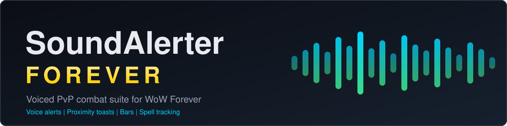
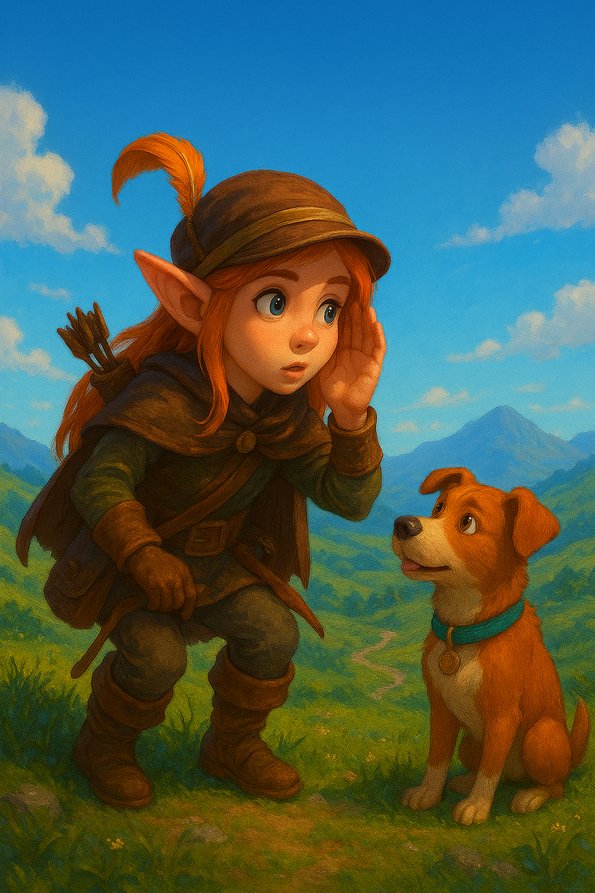
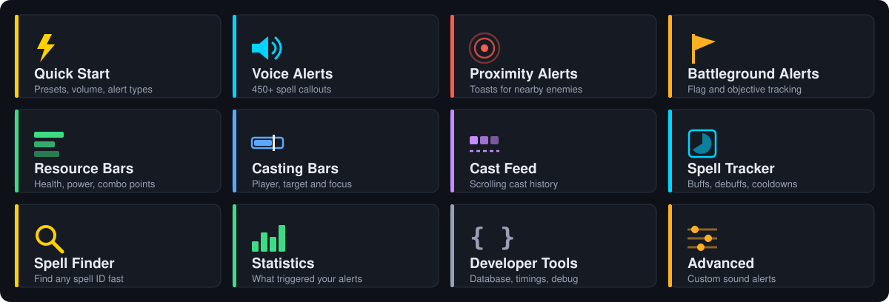
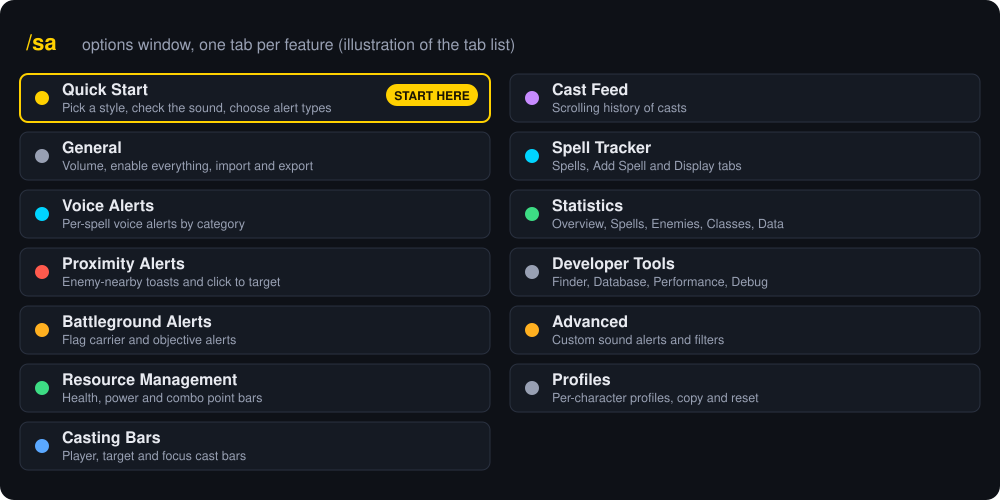
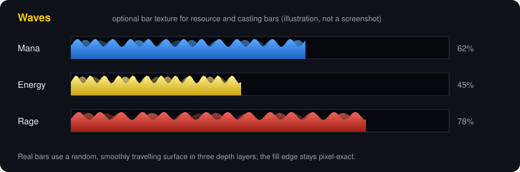
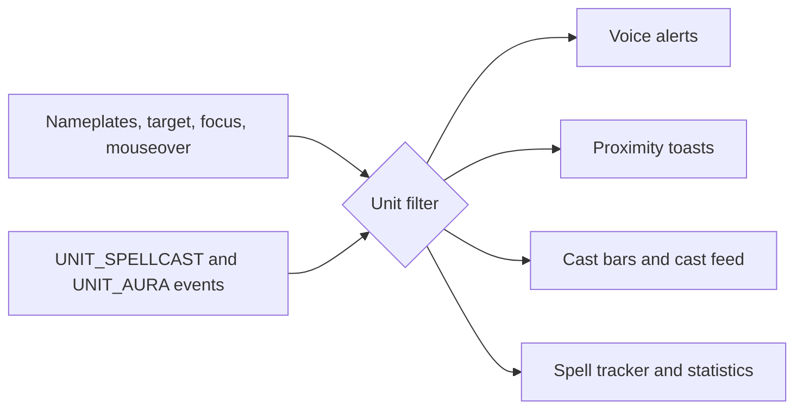

<b>Voiced PvP combat suite for WoW Forever.</b> 
Built on the legacy of SoundAlerter: voice callouts, proximity toasts, cast bars, resource bars and a spell tracker. 
<i>Still an early beta, please expect bugs.</i>

> [!IMPORTANT]
> **What changed:** WoW Forever permanently restricts `COMBAT_LOG_EVENT_UNFILTERED` for every third-party addon. That is a Blizzard platform decision, not a bug. SoundAlerter is rebuilt around nameplate and unit-event tracking instead.

| Gone | Kept |
| :--- | :--- |
| Zone-wide detection of enemies you haven't targeted or can't see a nameplate for | Voice alerts for your target, focus and every enemy with a visible nameplate |
| "Any enemy anywhere" custom sound matching | Proximity toasts, battleground flag tracking, bars, cast feed, spell tracker |
| Ally-side CC and cast monitoring | All your settings and custom alert rules carry over |

---

## What's In The Box

| Feature | What it does |
| :--- | :--- |
| **Quick Start** | Pick a style, test the sound, choose what you hear. Arena ready in a minute |
| **Voice Alerts** | 230+ spell callouts, organised by class, with presets and search |
| **Proximity Alerts** | Sticky toasts with distance, buffs and click-to-target |
| **Battleground Alerts** | Team-aware flag tracking for WSG and Eye of the Storm |
| **Resource Bars** | Health, power and combo points, with animated textures |
| **Casting Bars** | Player, target and focus bars with finish animations |
| **Cast Feed** | Scrolling cast history per unit |
| **Spell Tracker** | Buff, debuff and cooldown icons that keep working in combat |
| **Minimap Tracking** | Target and focus kept on the minimap across loading screens |
| **Spell Finder** | Search spell IDs and descriptions |
| **Statistics** | Which alerts fired, from whom, and where |

---

## Getting Started

1. Download the latest release and extract the `SoundAlerter` folder to `World of Warcraft/Interface/AddOns/`.
2. Launch WoW and click the minimap button, or type `/sa`.
3. Open **Quick Start**, pick a style, press **Play test sound**, and choose which alert types you want.

---

## Voice Alerts

Instant audio callouts for enemy cooldowns, crowd control and interrupts, for your target, focus and any enemy with a visible nameplate.

* **By class:** pick a class on the left, then switch events on or off per spell: Gained, Faded, Cast start, Cast, On you, On friend, On enemy, CC faded, Interrupts you
* **Presets with undo:** Arena, Battleground, Only what hits me, Big cooldowns, Silence all
* **Search** across every class by spell name or sound key
* **Interrupts:** your own interrupts, Feral Charge included, are announced with the spell you stopped; optional `/roar` emote
* **Chat alerts** go to Say, Party, Raid or Instance, and fall back to your own chat when no channel is available

**Configuration**: `/sa` -> Voice Alerts

---

## Proximity And Battlegrounds

* **Proximity toasts:** nearby enemies via nameplate, target or mouseover; Close / Nearby / Detected, group size, up to 3 buff icons with timers, one-click targeting, smooth stacking
* **Flag tracking:** class identification, team-aware pickup, drop and capture toasts

**Configuration**: `/sa` -> Proximity Alerts, Battleground Alerts
**Commands**: `/sa toast test`, `/sa flag metrics`

---

## Bars And Feeds

* **Resource bars:** Health, Mana, Energy, Rage and Combo Points, feral form support, pixel-perfect, event-driven
* **Bar textures** shared with the casting bars: Default, Solid, Transparent, plus Waves, Streaks, Motes and Fog

* **Casting bars:** player, target and focus, channeled and mid-cast support, finish animations, configurable direction
* **Cast feed:** one icon row per unit with hover details and time between casts (off by default). The client hides other units' casts, so some are shown generically

**Configuration**: `/sa` -> Resource Management, Casting Bars, Cast Feed

---

## Spell Tracker

* Player and target buffs, debuffs and cooldowns, working in combat
* Aura spiral, duration numbers and an optional depleting border timer
* "Ready!" when a spell is off cooldown, with state borders and glows (idle, buff, debuff, expiring, ready)
* Stays correct through druid form swaps (auras are matched by spell ID)

**Configuration**: `/sa` -> Spell Tracker

---

## Tools

* **Minimap Tracking:** keeps target and focus on the minimap after every loading screen (off by default). `/sa` -> General
* **Spell Finder:** search spell names and descriptions, with fuzzy matching and autocomplete.

* **Statistics:** session and all-time mix of spell, proximity, trinket, flag and interrupt alerts, with ranked spells, enemies and classes.
* **Developer Tools:** database status, performance timings and a Debug Mode that prints timestamped, module-tagged traces. `/sa` -> Developer Tools

---

## How It Works

Handlers filter on unit identity before touching any API. Aura alerts read the `UNIT_AURA` change list and only fall back to a spell-ID poll when the client hides it.

<b>Commands</b>

| Command | Action |
| :--- | :--- |
| `/sa` | Main options panel |
| `/sa help` | Full command list |
| `/sa stats` | Class detection statistics |
| `/sa toast status` | Proximity metrics |
| `/sa flag myteam` / `metrics` | BG team check and flag metrics |

Developer commands (`/sa toast test`, `/sa flag test`) need Debug Mode on.

---

## Technical Highlights

* **Ace3** framework, per-character profiles with export
* **Zero-taint:** protected frames are never touched in combat
* **Event-driven:** nameplates plus `UNIT_SPELLCAST_*` and `UNIT_AURA` on target, focus and tracked nameplates

---

**Author**: th3pajay · **License**: MIT, open for use, modification and distribution.

Fair winds, fellow adventurers!
*th3pajay / Starmistx - An old feral (https://warcraftmovies.com/pv.php?t=3&l=pajay)*
